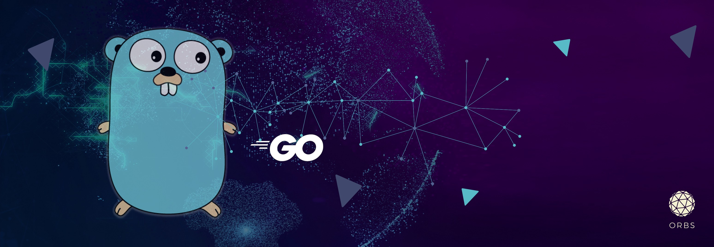

# Hello there, welcome to my Github page 👋

My name is Eric and today is Saturday, December 18, 6:12 AM CST. I am a software engineer at The Home Depot.

Please reach out to me on linkedin 

&nbsp;

:chart_with_upwards_trend: Github Stats

  
   

&nbsp;

✨ **Programming Languages currently using**

  
  
  
  

&nbsp;

:books: **Databases**

  
  
  
  

<!--
**ericcchiu/ericcchiu** is a ✨ _special_ ✨ repository because its `README.md` (this file) appears on your GitHub profile.

Here are some ideas to get you started:

- 🔭 I’m currently working on ...
- 🌱 I’m currently learning ...
- 👯 I’m looking to collaborate on ...
- 🤔 I’m looking for help with ...
- 💬 Ask me about ...
- 📫 How to reach me: ...
- 😄 Pronouns: ...
- ⚡ Fun fact: ...
-->
